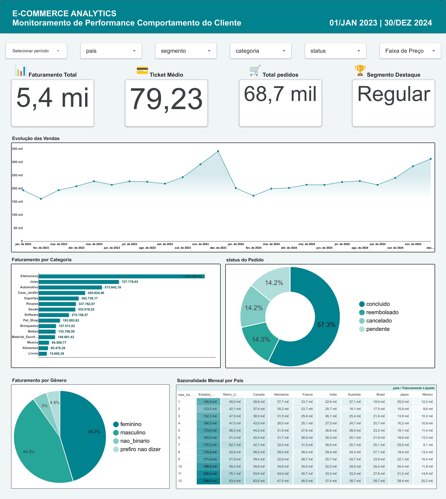

# Projeto: Pipeline e Análise de Comportamento de Consumo no E-commerce

## 📌 Visão Geral do Projeto

- **Problema abordado**: O mercado global de e-commerce em 2026 exige uma compreensão profunda do comportamento transacional, dinâmica de engajamento e métricas de retenção de clientes. Com mais de 120 mil transações e múltiplas dimensões de navegação, a análise intuitiva torna-se inviável. Este projeto mapeia gargalos na jornada do cliente, padrões de aquisição, sazonalidade e perfis de altíssimo valor (outliers).

- **Objetivo**: Identificar, quantificar e modelar as relações entre comportamento de compra, engajamento digital e métricas financeiras (faturamento, ticket médio, LTV), utilizando técnicas de engenharia de dados em larga escala com PySpark e visualização interativa no Looker Studio.

- **Metodologia**: Construção de um pipeline de dados automatizado utilizando **Google Colab (Python/PySpark)** para ETL e processamento distribuído, **Google BigQuery** como Data Warehouse, e **Looker Studio** para dashboards executivos com correções de telemetria e consistência relacional.

## 🎯 Etapas do Projeto

### 1. Otimização e Arquitetura de Dados no Google Cloud
- **Desafio de Volume e Inconsistência**: O dataset relacional contém 5 tabelas com mais de 120 mil transações, 80 mil sessões e 25 mil avaliações. Foi identificado um **Fan-out Effect** no JOIN direto entre transações e sessões (explosão cartesiana por cliente), além de divergência temporal entre telemetria e base financeira.
- **Estratégia de Correção na Nuvem**: A tabela `transacoes` foi mantida como **Single Source of Truth** para métricas financeiras. A tabela `sessoes` foi agregada por cliente com métricas consolidadas (total de sessões, tempo médio, lista de dispositivos), garantindo cardinalidade 1:1 e eliminando duplicações. Campos sem rastreamento foram preenchidos como `não_rastreado` e `direto`.

### 2. Fontes de Dados
| Fonte | Tipo | Método de Coleta | Link |
|-------|------|------------------|------|
| E-commerce Customer Behavior and Transactions Dataset | Estruturado (CSV - 5 tabelas relacionais) | Download Kaggle + ETL no Google Colab (PySpark) | [Kaggle Dataset](https://www.kaggle.com/datasets/lorenzoscaturchio/ecommerce-behavior) |

- **Registros Extraídos (Processados)**:
  - 10.000 clientes
  - 1.000 produtos (15 categorias analíticas)
  - 120.000 transações
  - 80.000 sessões de navegação
  - 25.000 avaliações de produtos
- **Escopo Temporal**: Série histórica completa (dados sintéticos de alta fidelidade)
- **Licença**: CC BY 4.0

### 3. Pipeline ETL e Análise Exploratória (EDA)
- **Scripts Python (Google Colab/PySpark)**:
  - [01_limpeza_preparacao.ipynb](scripts/01_limpeza_preparacao.ipynb) - Leitura das 5 tabelas CSV, tratamento de nulos, padronização de colunas, construção dos JOINs relacionais via `customer_id` e `product_id`, correção do Fan-out Effect com agregação prévia de sessões, e exportação da tabela unificada para formato Parquet.
  - [02_analise_exploratoria.ipynb](scripts/02_analise_exploratoria.ipynb) - Análise exploratória completa com estatísticas descritivas, matriz de correlações, distribuições por categoria, país, gênero, segmento, método de pagamento, status do pedido, sazonalidade mensal por país e identificação de outliers de alto valor (Top 20 clientes VIP).

**Bibliotecas utilizadas**:
- `pyspark` (Processamento distribuído para ETL em larga escala)
- `pandas` (Manipulação e validação complementar)
- `matplotlib`, `seaborn` (Visualizações estáticas)
- `google-cloud-bigquery` (Conexão e carregamento do Data Warehouse)
- `os`, `sys` (Gerenciamento de caminhos e ambiente de execução)

- **Principais descobertas e métricas gerais**:
  - 🇺🇸 **Liderança de Mercado**: EUA concentram o maior faturamento líquido (R$ 2.124.285,38 em 47.067 transações); Reino Unido em 2º (R$ 675.408,99).
  - 📊 **Paridade de Ticket Médio**: Ticket médio estável entre países (R$ 77,27 no Canadá a R$ 82,78 no Reino Unido).
  - ⚠️ **Gargalo Crítico de Retenção**: Apenas **57,3%** dos pedidos são concluídos (68,7k de 120k transações). Reembolsos (17.035), cancelamentos (17.108) e pendências (17.180) absorvem **42,7%** da operação.
  - 📈 **Correlação Estratégica**: Páginas Vistas vs. Adições ao Carrinho (r = +0,7836) — a correlação mais forte da base, evidenciando que reter o usuário na página aumenta conversão.
  - 👑 **Engajamento VIP**: Clientes VIP navegam em média 578 segundos e visualizam 193 páginas por sessão, gerando LTV médio de R$ 5.056,23 (vs. R$ 788,30 de Visitantes Ocasionais).
  - 🏷️ **Categoria Destaque**: Eletrônicos lideram receita com R$ 1.504.492,02, impulsionados pelo maior preço médio (R$ 195,67).
  - 💳 **Preferência de Pagamento**: Cartão de Crédito é o método preferido (34,6% dos pedidos); Apple Pay tem o maior ticket médio isolado (R$ 81,41).
  - 🔄 **Correlação LTV vs. Cancelamento**: r = -0,1991 — clientes com maior valor vitalício tendem a cancelar menos.
  - 📅 **Sazonalidade**: Pico de vendas em novembro/dezembro; estabilidade de janeiro a agosto com leve retração em fevereiro.
  - 👥 **Equilíbrio de Gênero**: Feminino (45,3% da receita, ticket R$ 79,06) vs. Masculino (44,9%, ticket R$ 79,49).
  - 🧩 **Outliers de Alto Valor**: 20 clientes com LTV > R$ 7.672,10 (3 desvios padrão acima da média), todos do segmento VIP, com destaque para o cliente C04587 (EUA, LTV de R$ 9.353,25).

### 4. Estrutura do Pipeline (Raw → BigQuery → Looker)
- **Camada RAW (`data/dados_brutos/`)**: Armazena os 5 arquivos CSV originais baixados do Kaggle.
- **Camada PROCESSED (`data/dados_tratados/`)**: Tabela unificada consolidada e exportada em formato **Parquet** (120 mil+ linhas).
- **Camada SUMMARY (`data/resumos_estatisticos/`)**: Arquivos CSV com métricas consolidadas da análise exploratória (correlações, distribuições, outliers, etc.).
- **Data Warehouse (Google BigQuery)**: Carregamento do arquivo Parquet como camada analítica, alimentando diretamente o dashboard no Looker Studio.
- **Dashboards (Looker Studio)**: Visualizações interativas com KPIs, evolução temporal, distribuição por categoria, métodos de pagamento e perfil de outliers.

### 5. Dashboard no Looker Studio

<div align="center">
  
</div>

<br>

- **Painel Executivo de Indicadores (jan/2023 - dez/2024)**:
  - **Cards Principais (KPIs)**: Faturamento Total (R$ 5,44 mi), Ticket Médio (R$ 79,23), Total de Pedidos (68,7 mil), Segmento Destaque (Regular).
  - **Evolução Temporal de Vendas**: Gráfico de linha mostrando a flutuação mensal do faturamento entre jan/2023 e dez/2024, com picos expressivos nos meses de novembro e dezembro e estabilidade nos primeiros quadrimestres.
  - **Faturamento por Categoria**: Eletrônicos lidera com R$ 1.504.492,02, seguido por Jóias (R$ 727.779,93), Automotivo (R$ 573.642,18), Casa/Jardim (R$ 420.824,46) e Esportes (R$ 362.736,17).
  - **Status do Pedido**: Distribuição mostrando que 57,3% dos pedidos são concluídos, 14,2% reembolsados, 14,3% cancelados e 14,2% pendentes - evidenciando um gargalo de 42,7% de pedidos não concluídos.
  - **Sazonalidade Mensal por País**: Matriz detalhada de faturamento por mês e país, destacando que EUA e Reino Unido concentram os maiores volumes, com pico em dezembro (EUA: R$ 246,6 mil; Reino Unido: R$ 83,4 mil).

## 🛠️ Tecnologias Utilizadas

| Ferramenta | Finalidade |
|------------|------------|
| Python (PySpark) | ETL distribuído e processamento em larga escala no Google Colab |
| Python (Pandas) | Manipulação e validação complementar |
| Python (Matplotlib, Seaborn) | Visualizações estáticas para análise exploratória |
| Google Colab | Ambiente de desenvolvimento do pipeline ETL |
| Google BigQuery | Data Warehouse (camada analítica para dados em Parquet) |
| Google Looker Studio | Dashboard interativo e visualização de dados |
| Google Drive | Repositório de dados brutos (Raw Layer) |
| Git / GitHub | Controle de versão e documentação do repositório |

## 📂 Estrutura do Repositório

```text
ecommerce-customer-behavior-analytics/
│
├── dash/
│   └── Dashboard_-_E-Commerce_Analytics__Comportamento_do_Cliente-1.png
│
├── data/
│   ├── dados_brutos/          # (raw/) - 5 arquivos CSV originais do Kaggle
│   │   ├── 11a_avaliacoes.csv
│   │   ├── 12a_sessoes.csv
│   │   ├── 13a_clientes.csv
│   │   ├── 14a_produtos.csv
│   │   └── 15a_transacoes.csv
│   ├── dados_tratados/        # (processed/) - Tabela unificada em Parquet (120k+ linhas)
│   │   └── tabela_limpa.parquet
│   └── resumos_estatisticos/  # (summary/) - CSVs com métricas consolidadas
│       ├── correlacoes_variaveis.csv
│       ├── dispersao_categoria.csv
│       ├── dispersao_faixa_status.csv
│       ├── dispersao_mes_status.csv
│       ├── distribuicao_genero.csv
│       ├── distribuicao_categoria.csv
│       ├── distribuicao_metodo_pagamento.csv
│       ├── distribuicao_pais.csv
│       ├── distribuicao_segmento.csv
│       ├── media_mediana_segmento.csv
│       └── outliers_ltv.csv
│
├── doc_relatorio/
│   └── Relatorio_Tecnico_comportamento_cliente_no_ecommerce.pdf
│
├── scripts/
│   ├── 01_limpeza_preparacao.ipynb
│   └── 02_analise_exploratoria.ipynb
│
├── .gitignore
└── README.md
